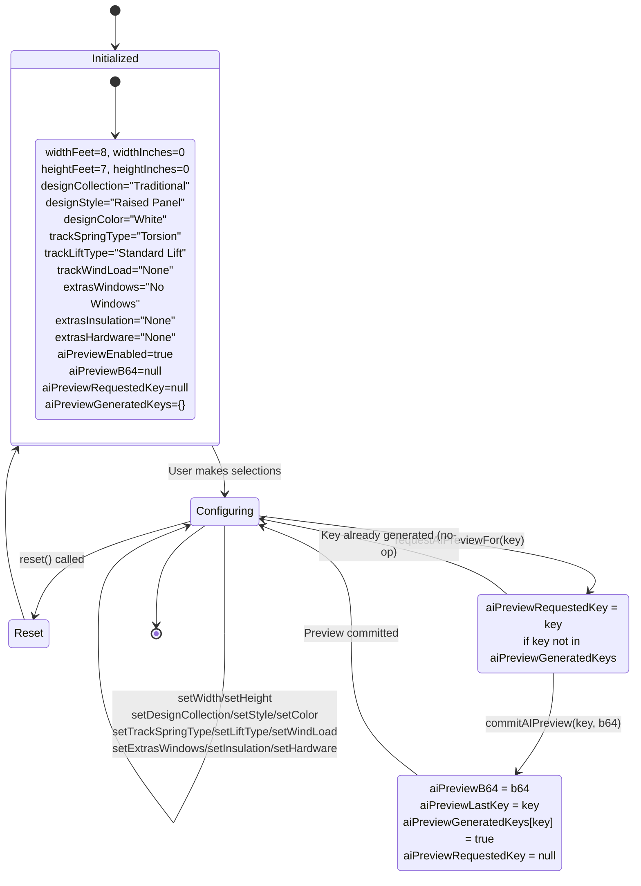
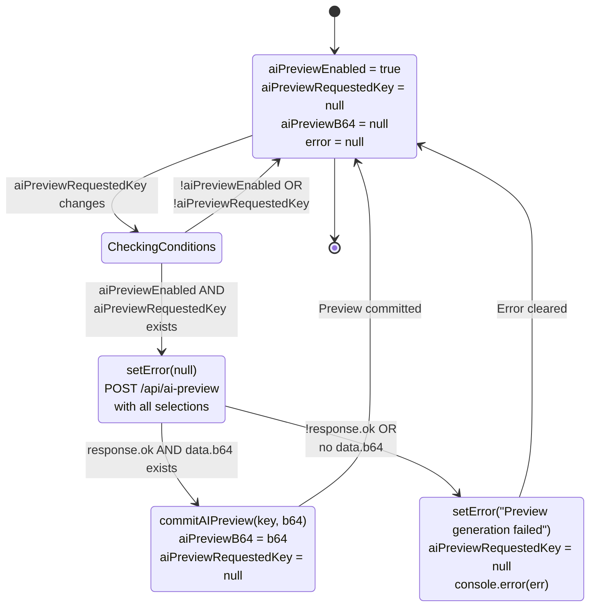
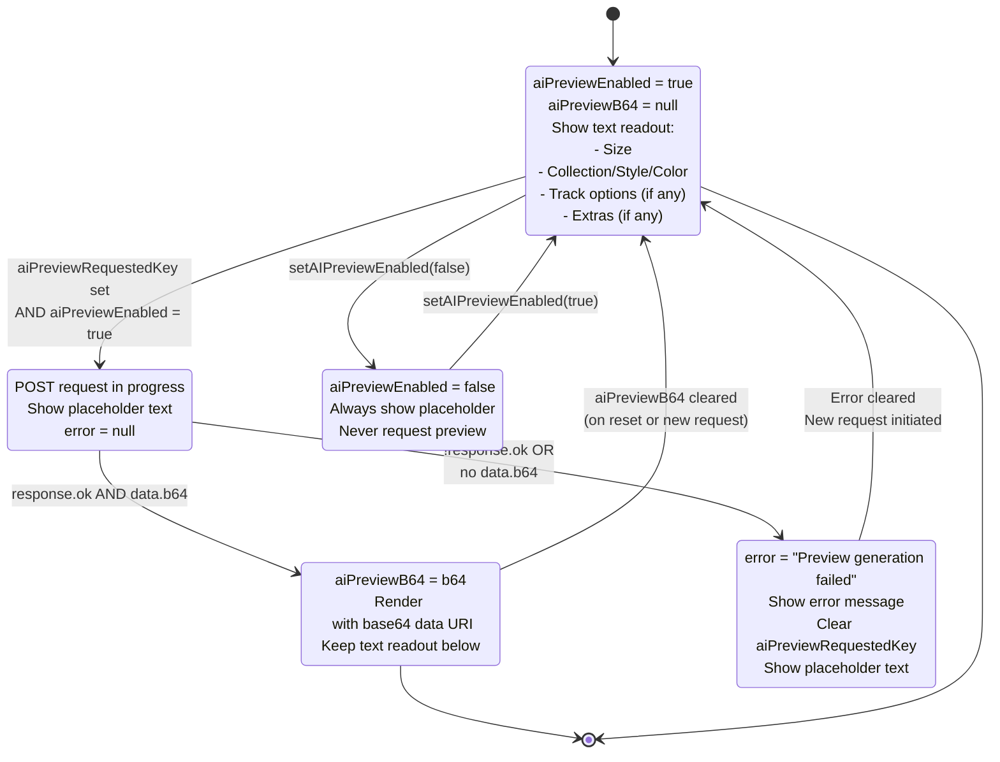
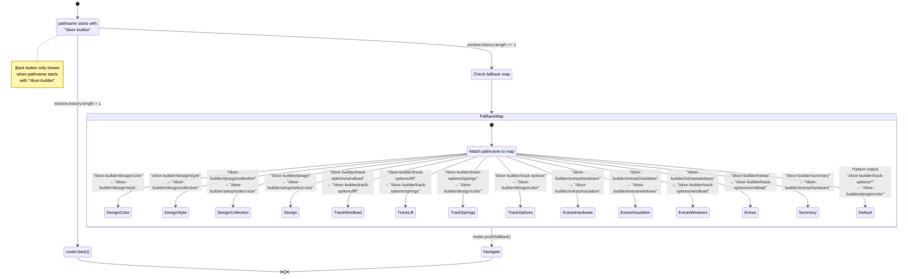
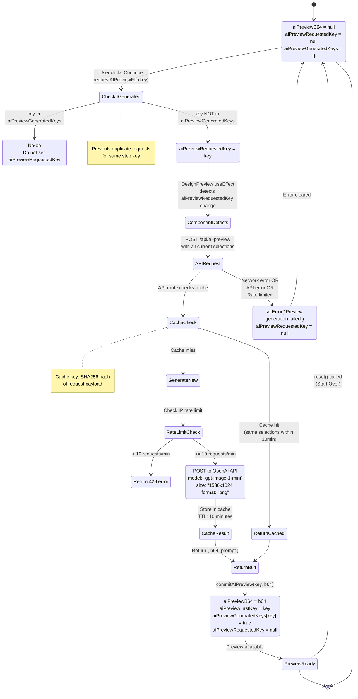

# State Machine Diagrams

This document contains state machine diagrams for the key components in the garage door builder application.

## 1. Builder Store State Machine

The main Zustand store manages all builder selections and AI preview state.

## 2. AI Preview Generation State Machine

The AI preview generation flow within the DesignPreview component.

## 3. Builder Navigation Flow State Machine

The step-by-step navigation through the builder process.

```mermaid
stateDiagram-v2
    [*] --> Home
    
    Home --> SetupSize: redirect("/door-builder")
    
    state SetupSize {
        [*] --> EnteringDimensions
        EnteringDimensions: Select width (feet/inches)<br/>Select height (feet/inches)
        EnteringDimensions --> DimensionsSet: setWidth() / setHeight()
        DimensionsSet --> ContinueToDesign: Click Continue<br/>requestAIPreviewFor("setup:size")
    }
    
    SetupSize --> DesignCollection: router.push("/door-builder/design")
    
    state DesignCollection {
        [*] --> SelectingCollection
        SelectingCollection: Select collection<br/>(Traditional/Modern/Carriage House)
        SelectingCollection --> CollectionSet: setDesignCollection()
        CollectionSet --> ContinueToStyle: Click Continue<br/>requestAIPreviewFor("design:collection")
    }
    
    DesignCollection --> DesignStyle: router.push("/door-builder/design/style")
    
    state DesignStyle {
        [*] --> SelectingStyle
        SelectingStyle: Select style<br/>(Raised Panel/Flush/Grooved)
        SelectingStyle --> StyleSet: setDesignStyle()
        StyleSet --> ContinueToColor: Click Continue<br/>requestAIPreviewFor("design:style")
    }
    
    DesignStyle --> DesignColor: router.push("/door-builder/design/color")
    
    state DesignColor {
        [*] --> SelectingColor
        SelectingColor: Select color<br/>(White/Almond/Black)
        SelectingColor --> ColorSet: setDesignColor()
        ColorSet --> ContinueToTrack: Click Continue<br/>requestAIPreviewFor("design:color")
    }
    
    DesignColor --> TrackSprings: router.push("/door-builder/track-options/springs")
    
    state TrackSprings {
        [*] --> SelectingSprings
        SelectingSprings: Select spring type<br/>(Torsion/Extension)
        SelectingSprings --> SpringsSet: setTrackSpringType()
        SpringsSet --> ContinueToLift: Click Continue<br/>requestAIPreviewFor("track:springs")
    }
    
    TrackSprings --> TrackLift: router.push("/door-builder/track-options/lift")
    
    state TrackLift {
        [*] --> SelectingLift
        SelectingLift: Select lift type<br/>(Standard Lift/High Lift)
        SelectingLift --> LiftSet: setTrackLiftType()
        LiftSet --> ContinueToWindload: Click Continue<br/>requestAIPreviewFor("track:lift")
    }
    
    TrackLift --> TrackWindload: router.push("/door-builder/track-options/windload")
    
    state TrackWindload {
        [*] --> SelectingWindload
        SelectingWindload: Select wind load<br/>(None/Wind Reinforced)
        SelectingWindload --> WindloadSet: setTrackWindLoad()
        WindloadSet --> ContinueToExtras: Click Continue<br/>requestAIPreviewFor("track:windload")
    }
    
    TrackWindload --> ExtrasWindows: router.push("/door-builder/extras/windows")
    
    state ExtrasWindows {
        [*] --> SelectingWindows
        SelectingWindows: Select windows<br/>(No Windows/Top Panel/Full View)
        SelectingWindows --> WindowsSet: setExtrasWindows()
        WindowsSet --> ContinueToInsulation: Click Continue<br/>requestAIPreviewFor("extras:windows")
    }
    
    ExtrasWindows --> ExtrasInsulation: router.push("/door-builder/extras/insulation")
    
    state ExtrasInsulation {
        [*] --> SelectingInsulation
        SelectingInsulation: Select insulation<br/>(None/Polystyrene/Polyurethane)
        SelectingInsulation --> InsulationSet: setExtrasInsulation()
        InsulationSet --> ContinueToHardware: Click Continue<br/>requestAIPreviewFor("extras:insulation")
    }
    
    ExtrasInsulation --> ExtrasHardware: router.push("/door-builder/extras/hardware")
    
    state ExtrasHardware {
        [*] --> SelectingHardware
        SelectingHardware: Select hardware<br/>(None/Black/Bronze)
        SelectingHardware --> HardwareSet: setExtrasHardware()
        HardwareSet --> ContinueToSummary: Click Continue<br/>requestAIPreviewFor("extras:hardware")
    }
    
    ExtrasHardware --> Summary: router.push("/door-builder/summary")
    
    state Summary {
        [*] --> ReviewingSelections
        ReviewingSelections: Display all selections<br/>Size, Design, Track, Extras
        ReviewingSelections --> GetQuote: Click "Get Quote"
        ReviewingSelections --> EditSelections: Click "Edit Selections"<br/>router.push("/door-builder/setup/select-size")
    }
    
    Summary --> SetupSize: Edit Selections
    Summary --> [*]: Get Quote (future)
    
    note right of SetupSize
        Back button uses router.back()
        or fallback mapping
    end note
    
    note right of DesignCollection
        Back navigates to SetupSize
    end note
    
    note right of Summary
        Start Over button calls
        store.reset() and navigates
        to SetupSize
    end note
```

## 4. DesignPreview Component Rendering State Machine

The rendering states of the DesignPreview component based on AI preview availability.

## 5. Builder Shell Navigation State Machine

The back button navigation logic in BuilderShell component.

## 6. AI Preview Request Flow State Machine

The complete flow of requesting and generating AI previews across the builder steps.

## State Variables Summary

### Builder Store States
- **Dimensions**: `widthFeet`, `widthInches`, `heightFeet`, `heightInches`
- **Design**: `designCollection`, `designStyle`, `designColor`
- **Track Options**: `trackSpringType`, `trackLiftType`, `trackWindLoad`
- **Extras**: `extrasWindows`, `extrasInsulation`, `extrasHardware`
- **AI Preview**: `aiPreviewEnabled`, `aiPreviewB64`, `aiPreviewLastKey`, `aiPreviewRequestedKey`, `aiPreviewGeneratedKeys`

### Component States
- **DesignPreview**: `error` (local state)
- **BuilderShell**: `pathname` (from Next.js router)
- **Navigation**: Route-based state transitions

## Key State Transitions

1. **User Selection** → `set*()` action → Store updated → Component re-renders
2. **Continue Click** → `requestAIPreviewFor(key)` → `aiPreviewRequestedKey` set → `useEffect` triggers → API call → `commitAIPreview()` → Preview displayed
3. **Back Click** → `router.back()` or fallback → Previous route → State persists
4. **Start Over** → `reset()` → All states reset to defaults → Navigate to setup
